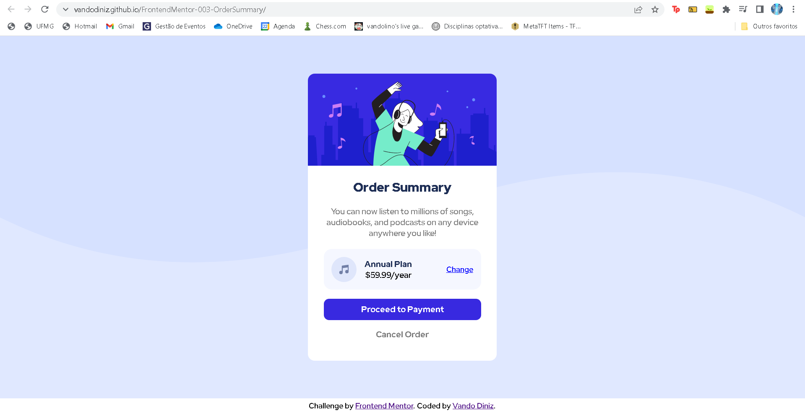
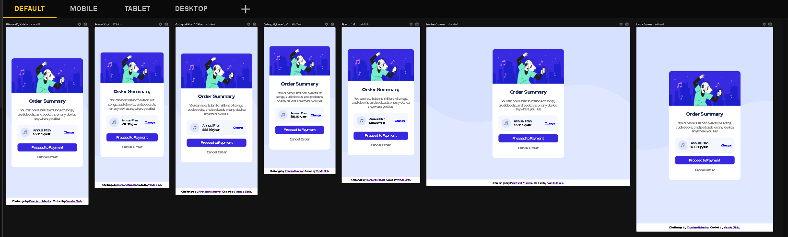

# Frontend Mentor - Order Summary Component

Essa é a solução do desafio [Order Summary Component](https://www.frontendmentor.io/challenges/order-summary-component-QlPmajDUj) do site FrontEnd Mentor! 

## Sumário

- [Visão Geral](#visão-geral)
  - [Screenshots](#screenshots)
  - [Links](#links)
  - [Autor](#autor)
- [Desenvolvimento](#desenvolvimento)
  - [Ferramentas Utilizadas](#ferramentas-utilizadas)
  - [Referêcias](#referências)

## Visão Geral

### Screenshots

### Links

- URL da Solução: https://www.frontendmentor.io/solutions/order-summary-component-SJXUxJEQ5
- URL do Site: https://vandodiniz.github.io/FrontendMentor-003-OrderSummary/

### Autor

- Frontend Mentor - [@vandodiniz](https://www.frontendmentor.io/profile/vandodiniz)
- Linkedin - [Vando Diniz](https://www.linkedin.com/in/vando-diniz-79b431234/)

## Desenvolvimento

### Ferramentas Utilizadas

- HTML 5 Semântico
- CSS
- Responsividade

### Referências

- [Desvendando o CSS Grid na prática | Mayk Brito](https://www.youtube.com/watch?v=HN1UjzRSdBk&ab_channel=Rocketseat) - Este video me ajudou a posicionar meu rodapé no fim da página usando os conceitos do display Grid.
